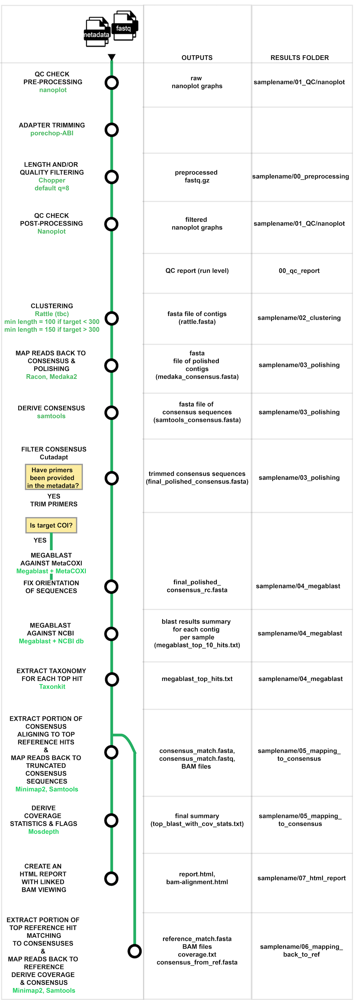

# ont_amplicon

## Introduction

ont_amplicon is a Nextflow-based bioinformatics pipeline designed to derive consensus sequences from **amplicon sequencing data** that was generated using **rapid library preparation kit** from **Oxford nanopore Technologies**. The pipeline expects the fastq files to have been generated using a **high accuracy (HAC)** basecalling model.  **The pipeline will fail to run if the fastq files provided are generated with a Fast basecalling model.**

It takes compressed fastq files as input.


## Pipeline overview



- Data quality check (QC) and preprocessing
  - Merge fastq files (Fascat) - optional
  - Raw fastq file QC (Nanoplot)
  - Trim adaptors (PoreChop ABI) - optional
  - Filter reads based on length and/or quality (Chopper) - optional
  - Reformat fastq files so read names are trimmed after the first whitespace (bbmap)
  - Processed fastq file QC (if PoreChop and/or Chopper is run) (Nanoplot)
- QC report
  - Derive read counts recovered pre and post data processing and post host filtering
- Clustering mode
  - Read clustering (Rattle)
  - Convert fastq to fasta format (seqtk)
  - Polishing (Minimap2, Racon, Medaka2, Samtools - optional)
  - Remove adapters if provided (Cutadapt)
  - Megablast homology search against COI database (if COI is targetted) and reverse complement where required
  - Megablast homology search against NCBI database
  - Derive top candidate hits, assign preliminary taxonomy and target organism flag (pytaxonkit)
  - Map reads back to segment of consensus sequence that align to reference and derive BAM file and alignment statistics (Minimap2, Samtools and Mosdepth)
  - Map reads to segment of NCBI reference sequence that align to consensus and derive BAM file and consensus (Minimap2, Samtools) - optional


## Installation
### Requirements  

Make sure you are using Windows subsystem for Linux if you are on a Windows machine. Please follow these [`steps`](https://www.ssl.com/how-to/enable-linux-subsystem-install-ubuntu-windows-10/).

If the pipeline is run on a local machine, it will require between 300-800Gb of space for the installation of required containers and databases alone. This includes:  
- 80 Mb ont_amplicon pipeline  
- ~ 3.8Gb for containers  
- 600Mb for taxonkit databases  
- 280Gb/760Gb for the blast NCBI database coreNT/NT
- 3.4Gb for the MetaCOXI database  

To run the pipeline will also require at least 2 cores and ~40Gb of memory per sample.  
The pipeline will generate ~5-100Mb of files per sample, depending on the number of consensuses recovered per sample and if mapping back to reference is required. Make sure you have enough space available on your local machine before running several samples at the same time.  

1. Install Java if not already on your system. Follow the java download instructions provided on this [`page`](https://www.nextflow.io/docs/latest/getstarted.html#installation).

2. Install [`Nextflow`](https://www.nextflow.io/docs/latest/getstarted.html#installation)

  Nextflow memory requirements

  In some cases, the Nextflow Java virtual machines can start to request a large amount of memory. We recommend adding the following line to your environment to limit this (typically in ~/.bashrc or ~./bash_profile): 
  ```
  NXF_OPTS='-Xms1g -Xmx4g'
  ```

3. Install [`Singularity`](https://docs.sylabs.io/guides/3.0/user-guide/quick_start.html#quick-installation-steps) to suit your environment. The pipeline has been validated using singularity version 3.10.2-1 and apptainer version 1.3.6-1.el9 but has not yet been tested with singularity version 4.

4. Set your singularity container cache directory. Copy paste the code below and press enter:  
```
[[ -d $HOME/.nextflow ]] || mkdir -p $HOME/.nextflow

cat <<EOF > $HOME/.nextflow/config
singularity {
    cacheDir = '$HOME/.nextflow/NXF_SINGULARITY_CACHEDIR'
    autoMounts = true
}
```
Specify a different `cacheDir` location if space is limited in your home directory.  


5. Install the taxonkit databases using the script install_taxonkit.sh located in the bin folder or follow the steps described on this [`page`](https://bioinf.shenwei.me/taxonkit/download/).


6. Install NCBI NT or coreNT.  
Download a local copy of the NCBI database of interest, following the detailed steps available at https://www.ncbi.nlm.nih.gov/books/NBK569850/. Create a folder where you will store your NCBI databases. It is good practice to include the date of download. For instance:
  ```
  mkdir blastDB/20230930
  ```
  You will need to use a current update_blastdb.pl script from the blast+ version used with the pipeline (ie 2.16.0).
  For example:
  ```
  singularity exec -B /scratch https://depot.galaxyproject.org/singularity/blast:2.16.0--h66d330f_4  update_blastdb.pl --decompress nt
  singularity exec -B /scratch https://depot.galaxyproject.org/singularity/blast:2.16.0--h66d330f_4  update_blastdb.pl --decompress taxdb
  tar -xzf taxdb.tar.gz
  ```
  
  Specify the full path of your local NCBI blast name in your parameter file; **the path should include nt/core_nt**.
  For instance:
  ```
  blastn_db: /full/path/to/blastDB/20230930/nt
  ```

7. Download the Cytochrome oxydase 1 (COI1) database if you are planning to analyse COI samples.
  ```
  wget https://zenodo.org/record/6246634/files/MetaCOXI_Seqs_1.tar.gz
  #extract MetaCOXI_Seqs.fasta from the MetaCOXI_Seqs.tar.gz file
  tar -xvzf MetaCOXI_Seqs.tar.gz
  #make a blast database from the fasta file
  singularity exec https://depot.galaxyproject.org/singularity/blast:2.16.0--h66d330f_4 makeblastdb -in MetaCOXI_Seqs.fasta -parse_seqids -dbtype nucl
  ```
Specify the full path to your COI database name in your in your parameter file.
  For instance:
  ```
  blastn_COI: /full/path/to/MetaCOXI_Seqs.fasta
  ```

## Running the pipeline  

### Quick start
The typical command for running the pipeline is as follows:
```
nextflow run main.nf -profile singularity -params-file params/params_mtdt_test.yml
```
With the following parmaters specified in the params_mtdt_test.yml. **Please update paths to databases to match your local set up**:
```
{
samplesheet: tests/index_mtdt.csv
merge: true
adapter_trimming: true
qual_filt: true
chopper_options: -q 8 -l 100
polishing: true
blastn_db: $HOME/ont_amplicon/tests/blastdb/reference.fasta
blastn_COI: $HOME/ont_amplicon/tests/COIdb/MetaCOXI_Seqs.fasta
taxdump: ~/.taxonkit
blast_threads: 2
analyst_name: John Smith
facility: MTDT
mapping_back_to_ref: true
}
```

And below is an example of an index.file:
```
sampleid,fastq_path,target_organism,target_gene,target_size,fwd_primer,rev_primer
VE24-1279_COI,/work/tests/mtdt_data/barcode01_VE24-1279_COI/*fastq.gz,drosophilidae,COI,711,GGTCAACAAATCATAAAGATATTGG,ATTTTTTGGTCACCCTGAAGTTTA
MP24-1051A_16S,/work/tests/mtdt_data/barcode06_MP24-1051A_16S/*fastq.gz,bacteria,16s,1509,AGAGTTTGATCATGGCTCAG,AAGTCGTAACAAGGTAACCGT
MP24-1096B_gyrB,/work/tests/mtdt_data/barcode19_MP24-1096B_gyrB/*fastq.gz,bacteria,gyrB,1258,GAAGTCATCATGACCGTTCTGCAYGCNGGNGGNAARTTYGA,ATGACNGAYGCNGAYGTNGAYGGCTCGCACATCCGTACCCTGCT
```

### Run the pipeline for the first time
-  To download the pipeline, you will need your github username and password.  
  
-  The source code can also be downloaded directly from GitHub using the git command:
  ```
  git clone https://github.com/maelyg/ont_amplicon.git
  ```
  Once you have downloaded the pipeline, you can either move into the pipeline **ont_amplicon** directory or direct Nextflow to the pipeline code by providing the full path to the **main.nf** file within the **ont_amplicon**. **Please note that you can only run one Nextflow analysis at a time from a given folder.**  

- Provide an index.csv file.  
  Create a **comma separated file (csv)** that will be the input for the workflow. 
  
  **Please note**: it is best to edit the csv file with an editor that does not add special characters/symbols (e.g. VSCode or Atom). If using other editors, check your files and if necessary, run [`dos2unix`](https://www.linuxfromscratch.org/blfs/view/git/general/dos2unix.html) on the file to get rid of these unwanted characters/symbols as they will cause the pipeline to fail.  
  
  By default the pipeline will look for a file called “index.csv” in the base directory but you can specify any file name using the ```--samplesheet [filename]``` in the parameter file, as long as it has a **.csv** suffix. This text file requires the following columns (which need to be included as a header): ```sampleid,fastq_path,target_organism,target_gene,target_size,fwd_primer,rev_primer``` 

   - **sampleid** will be the sample name that will be given to the files created by the pipeline (required).  
   - **fastq_path** is the full path to the fastq files that the pipeline requires as starting input (required).  
   - **target_organism** is the organism targetted by the PCR (required).  
   - **target_gene** is the gene targetted by the PCR (required).  
   - **target_size** is the expected size of the amplicon (required).  
   - **fwd_primer** is the nucleotide sequence of the FWD primer (optional).  
   - **rev_primer** is the nucleotide sequence of the REV primer (optional). Please note that the reverse primer chas to be reverse complemented so it reads in the 5-3 direction.  
   - **test** is a field specific to NAQS LIMS (optional)
   - **method** is a field specific to NAQS LIMS (optional)

  To specify parameters, we recommend that you use a parameter file. Please refer to this document for additional information on how to pass parameters and how parameter passing priority works (https://software.pixelgen.com/nf-core-pixelator/1.3.x/usage/passing-parameters/).  

  For the fastq files path, the pipeline can process 1) multiple fastq.gz files per sample located within one folder (default) or 2) a single fastq.gz file per sample.  
  If there are **multiple fastq.gz files per sample**, their full path can be specified on one line using **an asterisk (i.e. *fastq.gz)** and you will need to specify the parameter ```--merge``` in the parameter file (default setting).  
  See an example of an index.csv file for 2 MTDT samples:  
  ```
  sampleid,fastq_path,target_organism,target_gene,target_size
  VE24-1279_COI,/work/tests/mtdt_data/barcode01_VE24-1279_COI/*fastq.gz,drosophilidae,COI,711,GGTCAACAAATCATAAAGATATTGG,ATTTTTTGGTCACCCTGAAGTTTA
  MP24-1051A_16S,/work/tests/mtdt_data/barcode06_MP24-1051A_16S/*fastq.gz,bacteria,16s,1509,AGAGTTTGATCATGGCTCAG,AAGTCGTAACAAGGTAACCGT
  MP24-1096B_gyrB,/work/tests/mtdt_data/barcode19_MP24-1096B_gyrB/*fastq.gz,bacteria,gyrB,1258,GAAGTCATCATGACCGTTCTGCAYGCNGGNGGNAARTTYGA,ATGACNGAYGCNGAYGTNGAYGGCTCGCACATCCGTACCCTGCT
  ```
  For samples with a single fastq.gz file, specify **the full path to the fastq.gz file**  and set the merge parameter as false.  


- Specify your container engine ```singularity``` in the profile:
  ```
  nextflow run main.nf -profile singularity
  ```

- Provide a params.yml file with all your parameters:
```
nextflow run main.nf  -profile singularity -params-file params/params_mtdt_test.yml
```
These are the default parameters set by the pipeline:
```
{
samplesheet: /full/path/to/index.csv
merge: true
adapter_trimming: true
qual_filt: true
chopper_options: -q 8 -l 100
polishing: true
blastn_db: /full/path/to/NCBI/core_nt
blastn_COI: /full/path/to/MetaCOXI_Seqs.fasta
taxdump: ~/.taxonkit
analyst_name: Gauthier
facility: MTDT
}
```
- Specify the path to your blast and taxonkit databases in your parameter file.  The analysis cannot proceed without these being set.  

- Specify the ``--analyst_name`` and the ``--facility`` in your parameter file.  The analysis cannot proceed without these being set.  

- If you are invoking the pipeline from another folder, create a config file (for example local.config) in which you specify the full path of your local ont_amplicon repository.  
For example:  
```
singularity {
  runOptions = '-B /full/path/to/ont_amplicon:/mnt/ont_amplicon'
  }
```

And update your command to:  
```nextflow run /full/path/to/main.nf  -profile singularity -resume  -params-file  params.yml -c local.config```..

### Run tests
Two tests are currently provided to check if the pipeline was successfully installed and to demonstrate to users the current outputs generated by the pipeline prototype so they can provide feedback. 
- The mtdt_test runs three samples provided by  MTDT (barcode01_VE24-1279_COI, barcode06_MP24-1051A_16S and barcode19_MP24-1096B_gyrB). 
- The peq_test runs two samples provided by PEQ (ONT141 and ONT142). 
A small NCBI blast database and COI database have been derived to speed up the analysis run in test mode.  

To use the tests, change directory to ont_amplicon and run the following command for the MTDT test:
  ```
  nextflow run main.nf -profile singularity,mtdt_test -resume -params-file params/params_mtdt_test.yml
  ```
  and this command for the PEQ test:  
  ```
  nextflow run main.nf -profile singularity,peq_test -resume -params-file params/params_peq_test.yml
  ```

Please note that you will need to specify the location of the taxonkit databases folder in your command if it is not located where expected, at `~/.taxonkit` using the parameter `--taxdump path/to/taxonkit_db_folder`. For example:
  ```
  nextflow run main.nf -profile singularity,peq_test -resume -params-file params/params_peq_test.yml --taxdump /full/path/to/taxonkit_db/folder 
  ```

The tests should take less than 5 minutes to run to completion.

If the installation is successful, your screen should output something similar to this, with a completion and success status at the bottom:
```
 N E X T F L O W   ~  version 24.10.5

Launching `main.nf` [berserk_gutenberg] DSL2 - revision: 14779efa3e

executor >  pbspro (76)
[8f/37f88f] process > TIMESTAMP_START                                     [100%] 1 of 1 ✔
[9a/4ae987] process > FASTCAT (barcode19_MP24-1096B_gyrB)                 [100%] 3 of 3 ✔
[4b/c28438] process > QC_PRE_DATA_PROCESSING (barcode19_MP24-1096B_gyrB)  [100%] 3 of 3 ✔
[3a/3245aa] process > PORECHOP_ABI (barcode19_MP24-1096B_gyrB)            [100%] 3 of 3 ✔
[be/1a6a24] process > CHOPPER (barcode19_MP24-1096B_gyrB)                 [100%] 3 of 3 ✔
[e1/178003] process > REFORMAT (barcode19_MP24-1096B_gyrB)                [100%] 3 of 3 ✔
[27/dfdee1] process > QC_POST_DATA_PROCESSING (barcode19_MP24-1096B_gyrB) [100%] 3 of 3 ✔
[ed/547789] process > QCREPORT                                            [100%] 1 of 1 ✔
[bf/0b1014] process > RATTLE (barcode19_MP24-1096B_gyrB)                  [100%] 3 of 3 ✔
[71/803823] process > FASTQ2FASTA (barcode19_MP24-1096B_gyrB)             [100%] 3 of 3 ✔
[6c/8c02c0] process > MINIMAP2_RACON (barcode19_MP24-1096B_gyrB)          [100%] 3 of 3 ✔
[42/2b5a12] process > RACON (barcode19_MP24-1096B_gyrB)                   [100%] 3 of 3 ✔
[13/02e7b3] process > MEDAKA2 (barcode19_MP24-1096B_gyrB)                 [100%] 3 of 3 ✔
[9f/10d248] process > CUTADAPT (barcode19_MP24-1096B_gyrB)                [100%] 3 of 3 ✔
[8d/636107] process > BLASTN_COI (barcode01_VE24-1279_COI)                [100%] 1 of 1 ✔
[77/5b10fc] process > REVCOMP (barcode01_VE24-1279_COI)                   [100%] 1 of 1 ✔
[c4/119cf8] process > BLASTN (barcode01_VE24-1279_COI)                    [100%] 1 of 1 ✔
[fe/284a69] process > BLASTN2 (barcode19_MP24-1096B_gyrB)                 [100%] 2 of 2 ✔
[8e/7623d2] process > EXTRACT_BLAST_HITS (barcode19_MP24-1096B_gyrB)      [100%] 3 of 3 ✔
[ee/d92377] process > FASTA2TABLE (barcode19_MP24-1096B_gyrB)             [100%] 3 of 3 ✔
[25/32f878] process > MINIMAP2_REF (barcode19_MP24-1096B_gyrB)            [100%] 3 of 3 ✔
[9b/21ada5] process > SAMTOOLS (barcode19_MP24-1096B_gyrB)                [100%] 3 of 3 ✔
[01/69286e] process > MINIMAP2_CONSENSUS (barcode19_MP24-1096B_gyrB)      [100%] 3 of 3 ✔
[bf/351d07] process > SAMTOOLS_CONSENSUS (barcode19_MP24-1096B_gyrB)      [100%] 3 of 3 ✔
[0b/783c9e] process > PYFAIDX (barcode19_MP24-1096B_gyrB)                 [100%] 3 of 3 ✔
[bb/c64067] process > MOSDEPTH (barcode19_MP24-1096B_gyrB)                [100%] 3 of 3 ✔
[4e/20a073] process > COVSTATS (barcode19_MP24-1096B_gyrB)                [100%] 3 of 3 ✔
[6b/b98138] process > SEQTK (barcode19_MP24-1096B_gyrB)                   [100%] 3 of 3 ✔
[73/fbfcfe] process > HTML_REPORT (3)                                     [100%] 3 of 3 ✔
Completed at: 03-Apr-2025 09:47:49
Duration    : 5m 49s
CPU hours   : 0.2
Succeeded   : 76
```

By default, the output files will be saved under the **results** folder (this can be changed by setting the `outdir` parameter to soemthing else).  

The results folder has the following structure:  
```
├── 00_qc_report
│   ├── run_qc_report_20250428-091847.html
│   └── run_qc_report_20250428-091847.txt
├── 01_pipeline_info
│   ├── 20250428091444_nextflow_start_timestamp.txt
│   ├── 20250428092534_nextflow_start_timestamp.txt
│   ├── execution_report_2025-04-28_09-14-26.html
│   ├── execution_timeline_2025-04-28_09-14-26.html
│   ├── execution_trace_2025-04-28_09-14-26.txt
│   ├── execution_trace_2025-04-28_09-25-22.txt
│   └── pipeline_dag_2025-04-28_09-14-26.html
├── barcode01_VE24-1279_COI
│   ├── 00_preprocessing
│   │   ├── barcode01_VE24-1279_COI_preprocessed.fastq.gz
│   │   ├── chopper
│   │   │   └── barcode01_VE24-1279_COI_chopper.log
│   │   └── porechop
│   │       └── barcode01_VE24-1279_COI_porechop.log
│   ├── 01_QC
│   │   ├── fastcat
│   │   │   ├── barcode01_VE24-1279_COI_basecalling_model_inference.txt
│   │   │   └── barcode01_VE24-1279_COI.fastq.gz
│   │   └── nanoplot
│   │       ├── barcode01_VE24-1279_COI_filtered_LengthvsQualityScatterPlot_dot.html
│   │       ├── barcode01_VE24-1279_COI_filtered_NanoPlot-report.html
│   │       ├── barcode01_VE24-1279_COI_filtered_NanoStats.txt
│   │       ├── barcode01_VE24-1279_COI_raw_LengthvsQualityScatterPlot_dot.html
│   │       ├── barcode01_VE24-1279_COI_raw_NanoPlot-report.html
│   │       └── barcode01_VE24-1279_COI_raw_NanoStats.txt
│   ├── 02_clustering
│   │   ├── barcode01_VE24-1279_COI_rattle.fasta
│   │   └── barcode01_VE24-1279_COI_rattle.log
│   ├── 03_polishing
│   │   ├── barcode01_VE24-1279_COI_cutadapt.log
│   │   ├── barcode01_VE24-1279_COI_final_polished_consensus.fasta
│   │   ├── barcode01_VE24-1279_COI_medaka_consensus.fasta
│   │   ├── barcode01_VE24-1279_COI_racon_polished.fasta
│   │   └── barcode01_VE24-1279_COI_samtools_consensus.fasta
│   ├── 04_megablast
│   │   ├── barcode01_VE24-1279_COI_final_polished_consensus_match.fasta
│   │   ├── barcode01_VE24-1279_COI_final_polished_consensus_rc.fasta
│   │   ├── barcode01_VE24-1279_COI_final_polished_consensus_rc_megablast_top_10_hits.txt
│   │   ├── barcode01_VE24-1279_COI_final_polished_consensus_rc_megablast_top_hits.txt
│   │   └── barcode01_VE24-1279_COI_reference_match.fasta
│   ├── 05_mapping_to_consensus
│   │   ├── barcode01_VE24-1279_COI_aln.sorted.bam
│   │   ├── barcode01_VE24-1279_COI_aln.sorted.bam.bai
│   │   ├── barcode01_VE24-1279_COI_coverage.txt
│   │   ├── barcode01_VE24-1279_COI_final_polished_consensus_match.fasta
│   │   └── barcode01_VE24-1279_COI_top_blast_with_cov_stats.txt
│   ├── 06_mapping_to_ref
│   │   ├── barcode01_VE24-1279_COI_aln.sorted.bam
│   │   ├── barcode01_VE24-1279_COI_aln.sorted.bam.bai
│   │   ├── barcode01_VE24-1279_COI_coverage.txt
│   │   ├── barcode01_VE24-1279_COI_reference_match.fasta
│   │   └── barcode01_VE24-1279_COI_samtools_consensus_from_ref.fasta
│   └── 07_html_report
│       ├── bam-alignment.html
│       ├── example_report_context.json
│       ├── report.html
│       └── run_qc_report.html
```

### QC step
By default the pipeline will run a quality control check of the raw reads using NanoPlot.

- It is recommended to first run only the quality control step to have a preliminary look at the data before proceeding with downstream analyses by specifying the `qc_only: true` parameter.

### Preprocessing reads
If multiple fastq files exist for a single sample, they will first need to be merged using the `merge: true` option using [`Fascat`](https://github.com/epi2me-labs/fastcat).
Then the read names of the fastq file created will be trimmed after the first whitespace, for compatiblity purposes with all downstream tools.  

Reads can also be optionally trimmed of adapters and/or quality filtered:  
- Search for presence of sequencing adapters in sequences reads using [`Porechop ABI`](https://github.com/rrwick/Porechop) by specifying the ``adapter_trimming: true`` parameter. Porechop ABI parameters can be specified using ```porechop_options: '{options} '```, making sure you leave a space at the end before the closing quote. Please refer to the Porechop manual.  

  **Special usage:**  
  To limit the search to known adapters listed in [`adapter.py`](https://github.com/bonsai-team/Porechop_ABI/blob/master/porechop_abi/adapters.py), just specify the ```adapter_trimming: true``` parameter.  
  To search ab initio for adapters on top of known adapters, specify:
  ```
  adapter_trimming: true 
  porechop_options: '-abi '
  ```  
  To limit the search to custom adapters, specify 
  ```
  adapter_trimming: true
  porechop_custom_primers: true
  porechop_options '-ddb '
  ```
  and list the custom adapters in the text file located under bin/adapters.txt following the format:  
  ```
  line 1: Adapter name
  line 2: Start adapter sequence
  line 3: End adapter sequence
  --- repeat for each adapter pair---
  ```

- Perform a quality filtering step using [`Chopper`](https://github.com/wdecoster/chopper) by specifying  the ```qual_filt: true``` parameter. The following parameters can be specified using the ```chopper_options: {options}```. Please refer to the Chopper manual.  
  For instance to filter reads shorter than 1000 bp and longer than 20000 bp, and reads with a minimum Phred average quality score of 10, you would specify in your parameter file: 
  ```
  qual_filt: true
  chopper_options: -q 10 -l 1000 --maxlength 20000
  ```
**Based on our benchmarking, we recommend using the following parameters ```chopper_options: -q 8 -l 100``` as a first pass**.  

  If you are analysing samples that are of poor quality (i.e. failed the QC_FLAG) or amplifying a very short amplicon (e.g. <150 bp), then we recommend using the following setting ```chopper_options: -q 8 -l 25``` to retain reads of all lengths.  

A zipped copy of the resulting **preprocessed** and/or **quality filtered fastq file** will be saved in the preprocessing folder.  

If you trim raw read of adapters and/or quality filter the raw reads, an additional quality control step will be performed.  

A qc report will be generated in text and html formats summarising the read counts recovered after the pre-processing step for all samples listed in the index.csv file.
It will include 3 flags:  
1) For the raw_reads_flag, if there were < 5000 raw reads, the column will display: "Less than 5000 raw reads".  
2) For the qfiltered_flag, if there were < 1000 quality_filtered_reads, the column will display: "Less than 1000 processed reads".  
3) QC_FLAG:
- GREEN = > 5000 starting reads, > 1000 quality filtered reads.
- ORANGE = < 5000 starting reads, > 1000 quality filtered reads.
- RED = < 5000 starting reads, < 1000 quality filtered reads.

If the user wants to check the data after preprocessing before performing downstream analysis, they can apply the parameter `preprocessing_only: true`.

### Clustering step (RATTLE)

In the clustering mode, the tool [`RATTLE`](https://github.com/comprna/RATTLE#Description-of-clustering-parameters) will be run. 

- The ont_amplicon pipeline will automatically set a **lower read length** of **100** bp during the RATTLE clustering step if the amplicon target_size specified in the csv file is **<=300 bp**.  
- If the amplicon target_size specified in the csv file is **>300 bp**, the lower read length of **150 bp** (Rattle default) will be applied at the RATTLE clustering step instead.  
- For poor quality samples (i.e. failed the QC_FLAG) or if your amplicon is known to be shorter than 150 bp, use the parameter `rattle_raw: true` to use all the reads without any length filtering during the RATTLE clustering step.  
- Finally, the `rattle_clustering_max_variance` is set by default to 1,000,000.  

  **Special usage:**
  The parameters `rattle_clustering_min_length: [number]` (by default: 150) and `rattle_clustering_max_length: [number]` (by default: 100,000) can also be specified in the parameter file to restrict read size more strictly.  
  Additional parameters (other than raw, lower-length, upper-length and max-variance) can be set using the parameter `rattle_clustering_options: [additional paramater]`.  

Example of parameter file in which all reads will be retained during the clustering step:  
```
{
samplesheet: tests/index_mtdt.csv
merge: true
adapter_trimming: true
qual_filt: true
chopper_options: -q 8 -l 25
rattle_raw: true
polishing: true
blastn_db: $HOME/ont_amplicon/tests/blastdb/reference.fasta
blastn_COI: $HOME/ont_amplicon/tests/COIdb/MetaCOXI_Seqs.fasta
taxdump: ~/.taxonkit
blast_threads: 2
analyst_name: John Smith
facility: MTDT
mapping_back_to_ref: true
}

Example in which reads are first quality filtered using the tool chopper (only reads with a Phread average quality score above 10 are retained). Then for the clustering step, only reads ranging between 500 and 2000 bp will be retained:  
```
{
samplesheet: tests/index_mtdt.csv
merge: true
adapter_trimming: true
qual_filt: true
chopper_options: -q 8 -l 100
rattle_clustering_min_length: 200
rattle_clustering_max_length: 2000
polishing: true
blastn_db: $HOME/ont_amplicon/tests/blastdb/reference.fasta
blastn_COI: $HOME/ont_amplicon/tests/COIdb/MetaCOXI_Seqs.fasta
taxdump: ~/.taxonkit
blast_threads: 2
analyst_name: John Smith
facility: MTDT
mapping_back_to_ref: true
}

### Polishing step (optional)
The clusters derived using RATTLE can be polished. The reads are first mapped back to the clusters using Minimap2 and then the clusters are polished using Racon, Medaka2 and Samtools consensus. 
This step is performed by default by the pipeline but can be skipped by specifying the paramater ``--polishing false``.  

### Primer search
If the fwd_primer and the rev_primer have been provided in the csv file, clusters are then searched for primers using Cutadapt.  

### Blast homology search against NCBI
If the gene targetted is Cytochrome oxidase I (COI), a preliminary megablast homology search against a COI database will be performed; then based on the strandedness of the consensus in the blast results, some will be reverse complemented where required.  

Blast homology search of the consensuses against NCBI is then performed and the top 10 hits are returned.
A separate blast output is then derived using pytaxonkit, which outputs preliminary taxonomic assignment to the top blast hit for each consensus. The nucleotide sequence of qseq (ie consensus match) and sseq (ie reference match) are extracted to use when mapping reads back to consensus and reference respectively (see steps below).  

### Mapping back to consensus
The quality filtered reads derived during the pre-processing step are mapped back to the consensus matches using Mimimap2. Samtools and Mosdepth are then used to derive bam files and coverage statistics. A summary of the blast results, preliminary taxonomic assignment, coverage statistics and associated flags are then derived for each consensus using python.  
Currently applied flags include:  
1) 30X DEPTH FLAG:
  - GREEN = when mapping back to consensus match (ie qseq), the percentage of bases that attained at least 30X sequence coverage > 90
  - ORANGE = when mapping back to consensus match (ie qseq), the percentage of bases that attained at least 30X sequence coverage is between 75 and 90
  - RED = when mapping back to consensus match (ie qseq), the percentage of bases that attained at least 30X sequence coverage is < 75
  - GREY = consensus returned no blast hits
 
2) TARGET ORGANISM FLAG
  - GREEN = target organism detected and % blast identity > 90%
  - ORANGE = target organism detected and % blast identity is < 90%
  - RED = target organism not detected
  - GREY = consensus returned no blast hits
 
3) TARGET SIZE FLAG
  - GREEN = the consensus match length is within ±20% of the target_size
  - ORANGE = the consensus match length is ±20% to ±40% of target size
  - RED = the consensus match length is outside the range of ±40% of the target_size.
 
4) MAPPED READ COUNT FLAG
  - GREEN = when mapping back to the consensus match (ie qseq), read count is >=1000
  - ORANGE = when mapping back to the  consensus match (ie qseq), read count is between 200 and 1000
  - RED = when mapping back to the consensus match (ie qseq), read count is <200
  - GREY = consensus returned no blast hits
 
 5) MEAN COVERAGE FLAG
  - GREEN = when mapping back to the consensus match (ie qseq), the mean coverage >=500
  - ORANGE = when mapping back to the consensus match (ie qseq), the mean coverage is between 100 and 500
  - RED = when mapping back to the consensus match (ie qseq), the mean coverage is < 100
  
### Mapping back to reference (optional)
By default the quality filtered reads derived during the pre-processing step are also mapped back to the
reference blast match and Samtools consensus is used to derive independent guided-reference consensuses. Their nucleotide sequences can be compared to that of the original consensuses to resolve ambiguities (ie low complexity and repetitive regions).  

### HTML report
An html summary report is generated for each sample, incorporating sample metadata, QC before and after 
preprocessing, blast results and coverage statistics. It also provides a link to the bam files generated when ampping back to consensus.  

## Output files
The output files will be saved under the results folder by default. This can be changed by setting the `outdir` parameter.  

### Nextflow reports
Nextflow generates several outputs which are stored under the **01_pipeline_info** folder. Please find detailed information about these on this [page](https://www.nextflow.io/docs/latest/reports.html). All of these have the date and time appended as a suffix.

#### HTML execution report
Nextflow outputs an **HTML execution report** which includes general metrics about the run. The report is organised into 3 main sections:  
- The **Summary** section reports the execution status, the launch command, overall execution time and some other workflow metadata.  
- The **Resources** section plots the distribution of resource usage for each workflow process. Plots are shown for CPU, memory, job duration and disk I/O. They have two (or three) tabs with the raw values and a percentage representation showing what proportion of the requested resources were used. These plots are very helpful to check that task resources are used efficiently.  
- The **Tasks** section lists all executed tasks, reporting for each of them the status, the actual command script, and many other metrics.  

#### Trace file
Nextflow creates an execution tracing text file that contains some useful information about each process executed in your pipeline script, including: submission time, start time, completion time, cpu and memory used.  

#### Execution timeline
Nextflow can render an HTML timeline for all processes executed in your pipeline. Each bar represents a process run in the pipeline execution. The bar length represents the task duration time (wall-time). The colored area in each bar represents the real execution time. The grey area to the left of the colored area represents the task scheduling wait time. The grey area to the right of the colored area represents the task termination time (clean-up and file un-staging). The numbers on the x-axis represent the time in absolute units e.g. minutes, hours, etc.  

Each bar displays two numbers: the task duration time and the virtual memory size peak.  

As each process can spawn many tasks, colors are used to identify those tasks belonging to the same process.  

#### Workflow diagram
The pipeline executed is represented as an HTML diagram in direct acyclic graph format. The vertices in the graph represent the pipeline’s processes and operators, while the edges represent the data dependencies (i.e. channels) between them.

### Preprocessing and host read filtering outputs
If a merge step is required, fastcat will create a summary text file showing the read length distribution.  
Quality check will be performed on the raw fastq file using [NanoPlot](https://github.com/wdecoster/NanoPlot) which is a tool that can be used to produce general quality metrics e.g. quality score distribution, read lengths and other general stats. A NanoPlot-report.html file will be saved under the **SampleName/qc/nanoplot** folder with the prefix **raw**. This report displays 6 plots as well as a table of summary statistics.  

<p align="center"></p>

Example of output plots:
<p align="center"></p>
<p align="center"></p>

A preprocessed fastq file will be saved in the **SampleName/preprocessing** output directory which will minimally have its read names trimmed after the first whitespace, for compatiblity purposes with all downstream tools. This fastq file might be additionally trimmed of adapters and/or filtered based on quality and length (if PoreChopABI and/or Chopper were run).  

After quality/length trimming, a PoreChopABI log will be saved under the **SampleName/preprocessing/porechop** folder.  

After adapter trimming, a Chopper log file will be saved under the **SampleName/preprocessing/chopper** folder.  

If adapter trimming and/or quality/length trimming is performed, a second quality check will be performed on the processsed fastq file and a NanoPlot-report.html file will be saved under the **SampleName/qc/nanoplot** folder with the prefix **filtered**.  

If the adapter trimming and/or the quality filtering options have been run, a QC report will be saved both in text and html format (i.e. **run_qc_report_YYYYMMDD-HHMMSS.txt** and **run_qc_report_YYYYMMDD-HHMMSS.html**) under the **qc_report** folder.  

Example of report:

| Sample| raw_reads | quality_filtered_reads | percent_quality_filtered | raw_reads_flag | qfiltered_flag | QC_FLAG |
| --- | --- | --- | --- | --- | --- | --- |
| ONT141 | 10929 | 2338 | 21.39 | | | GREEN |
| ONT142| 21849 | 4232 | 9.37 | | | GREEN |

### Clustering step outputs  
In this mode, the output from Rattle will be saved under **SampleName/clustering/rattle/SampleName_rattle.fasta**. The number of reads contributing to each clusters is listed in the header. The amplicon of interest is usually amongst the most abundant clusters (i.e. the ones represented by the most reads).  

### Polishing step outputs 
(in progress)  

### Blast search outputs  
All the top hits derived for each contig are listed in the file **SampleName/megablast/SampleName_final_polished_consensus_megablast_top_10_hits.txt**. This file contains the following 26 columns:
```
- qseqid
- sgi
- sacc
- length
- nident
- pident
- mismatch
- gaps
- gapopen
- qstart
- qend
- qlen
- sstart
- send
- slen
- sstrand
- evalue
- bitscore
- qcovhsp
- stitle
- staxids
- qseq
- sseq
- sseqid
- qcovs
- qframe
- sframe
```

A separate blast output called **SampleName/megablast/SampleName_final_polished_consensus_megablast_top_hit.txt** is then derived using pytaxonkit, which outputs preliminary taxonomic assignment to the top blast hit for each consensus. A **broad_taxonomic_category** column is generated which matches the cluster to broad taxon categories:
- virus  
- bacteria;phytoplasma  
- bacteria;other  
- archea  
- eukaryota;fungi;powdery_mildew  
- eukaryota;fungi;other  
- eukaryota;deuterostomia  
- eukaryota;protostomia  
- eukaryota; other  
- other  

A column called **FullLineage** provides the full taxonomic lineage derived from taxonkit.  
The colum **target_organism_match** indicates whether there is a taxon match between the target_organism specified in the samplesheet and the full taxonomic lineage.  
The **n_read_cont_cluster** captures the number of reads that originally contributed to build the clusters during the RATTLE step.  

The nucleotide sequence of qseq (ie consensus match) and sseq (ie reference match) are extracted to use when mapping reads back to consensus and reference respectively (see steps below). These are called **SampleName/megablast/SampleName_final_polished_consensus_match.fasta** and **SampleName/megablast/SampleName_reference_match.fasta** respectively.  

### Outputs from the mapping reads back to consensus matches step
(in progress)

### Outputs from mapping reads back to reference matches step
By default the quality filtered reads derived during the pre-processing step are mapped back to the
reference blast match. A bam file is generated and Samtools consensus is used to derive independent guided-reference consensuses that are stored in a file called **SampleName/mapping_back_to_ref/samtools_consensus_from_ref.fasta** file. Their nucleotide sequences can be compared to that of the original consensuses to resolve ambiguities (ie low complexity and repetitive regions). 

### HTML report output
(in progress)  

## Authors
Marie-Emilie Gauthier gauthiem@qut.edu.au  
Cameron Hyde c.hyde@qcif.edu.au  

## To do :
Update image depicting the current flow of the pipeline  
Finish output section  

**-html report specific**
Incorporate basecalling model in html report  
Improve reporting errors when RATTLE fails to produce clusters and prevent pipeline from crashing, add in report that no clusters were generated.  


Generate a QC report even if preprocessing is not run to capture the raw read counts?  
Provide option to run only map to ref